 
# Цель работы
 
Изучить linux.
 
# Выполнение лабораторной работы
 
1. Общая информация о курсе
 
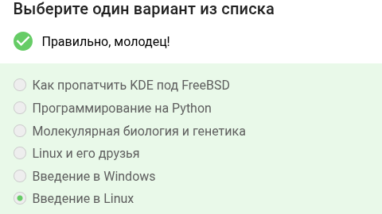
 
Правильный ответ — "Введение в Linux", так как именно этот курс соответствует теме изучения основ Linux.
 
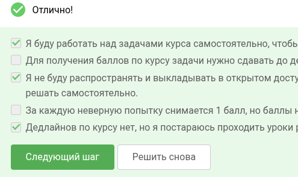
 
Отмечены все пункты (самостоятельное решение, соблюдение дедлайнов, нераспространение материалов), что является обязательным требованием для допуска к заданиям.
 
2. Как установить Linux
 
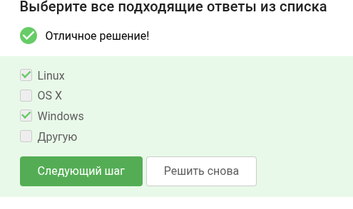
 
Отмечены Linux и Windows, так как Linux можно установить как основную ОС или в виртуальном окружении на Windows.
 
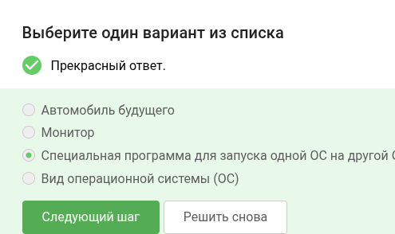
 
Выбран вариант «Специальная программа для запуска одной ОС на другой ОС», так как это точное описание технологии виртуализации.
 
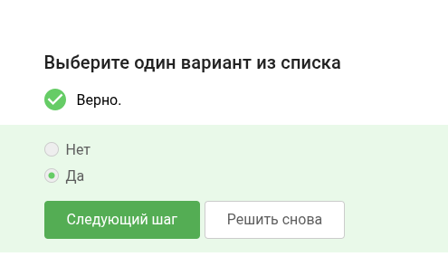
 
Выбран ответ «Да», так как предыдущий материал усвоен верно.
 
3. Осваиваем Linux
 
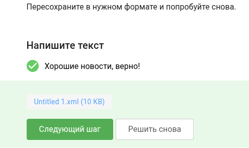
 
Требовалось преобразовать файл в корректный формат (вероятно, XML).
 
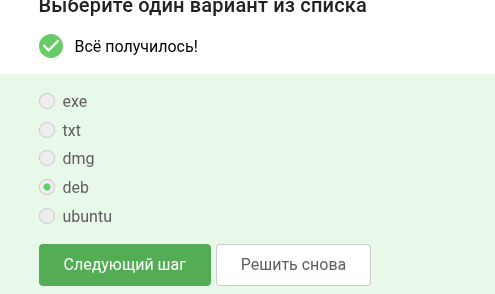
 
Правильный ответ — «deb», так как это стандартный формат пакетов в дистрибутивах на основе Debian (включая Ubuntu).
 
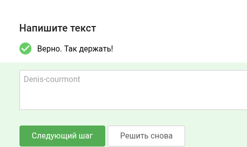
 
Введён правильный ответ «Denis-courmont».
 
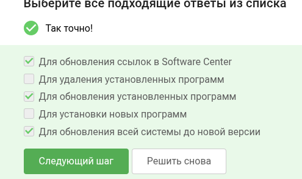
 
Отмечены варианты «Для обновления установленных программ» и «Для обновления всей системы до новой версии». Команда apt update обновляет список пакетов, а apt upgrade — сами программы; apt dist-upgrade — обновление версии системы.
 
4. Terminal: основы
 
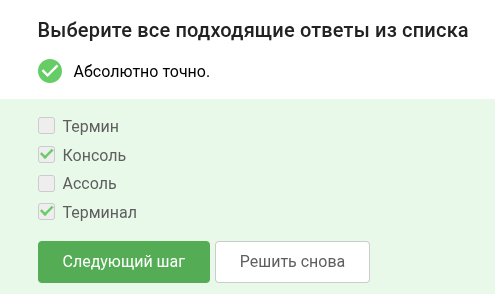
 
Правильные термины — «Консоль» и «Терминал». Оба слова используются как синонимы для интерфейса командной строки.
 
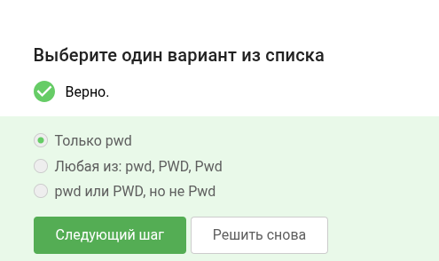
 
Верен только вариант «pwd» (строчными буквами), так как в Linux команды чувствительны к регистру.
 
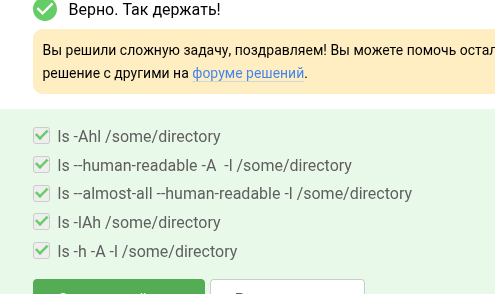
 
Выбраны все корректные комбинации: -Ahl, –human-readable -A -l, –almost-all –human-readable -l, -IAh, -h -A -l. Ключ -A (почти все, кроме . и ..), -l (подробный список), -h (человеко-читаемые размеры).
 
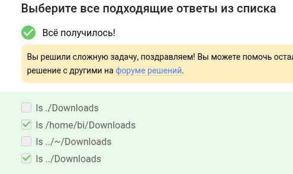
 
Правильные варианты — абсолютный путь /home/bi/Downloads и относительный ../Downloads (если текущая директория — подкаталог home/bi).
 
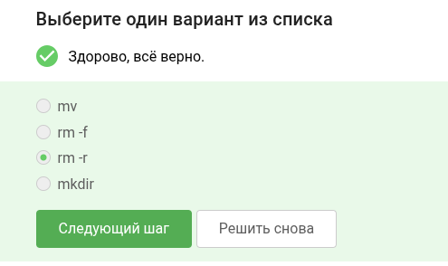
 
Выбрана команда rm -r (рекурсивное удаление). mv — перемещение, rm -f — удаление файлов без рекурсии, mkdir — создание директории.
 
5. Запуск исполняемых файлов
 
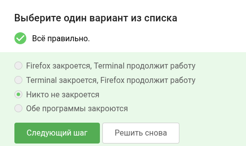
 
Ответ «Никто не закроется», так как запущенные процессы (Firefox) отсоединяются от терминала и продолжают работу.
 
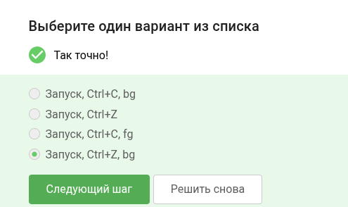
 
Правильная последовательность: запуск, Ctrl+Z (приостановка), bg (запуск в фоне). Ctrl+C завершает процесс, fg возвращает на передний план.
 
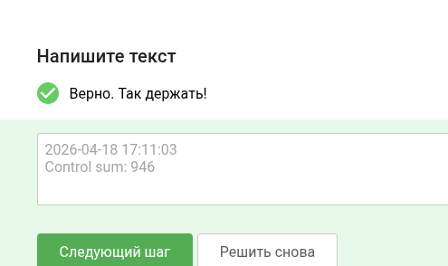
 
Требовалось указать текущую дату и время (2026-04-18 17:11:03) и контрольную сумму 946.
 
6. Ввод / вывод
 
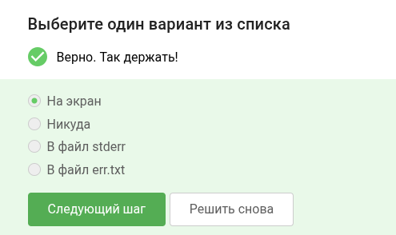
 
Правильный вариант — «В файл err.txt». Для этого используется конструкция 2> err.txt.
 
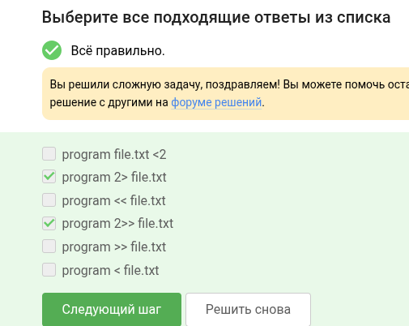
 
Правильные команды: program 2> file.txt (перезапись) и program 2>> file.txt (добавление в конец). Остальные варианты перенаправляют stdout или ввод.
 
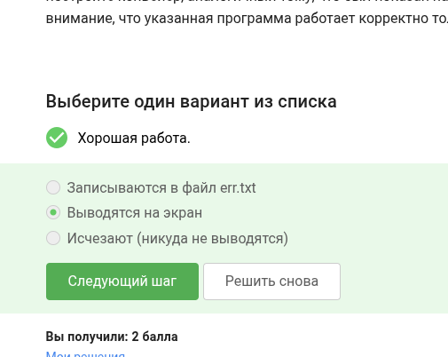
 
Верный ответ — «Записываются в файл err.txt», то есть они не выводятся на экран и не исчезают, а сохраняются в указанный файл.
 
7. Скачивание файлов из интернета
 
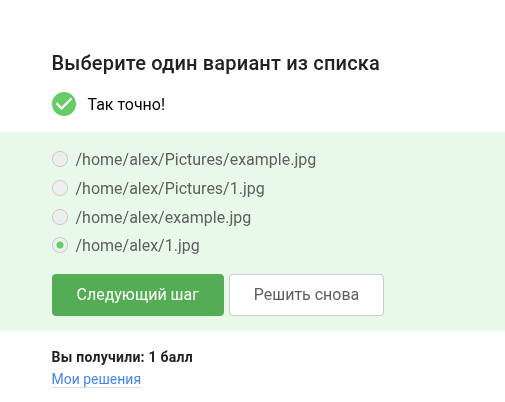
 
Правильный путь — /home/alex/example.jpg, так как wget сохраняет файл в текущую директорию с оригинальным именем (example.jpg).
 
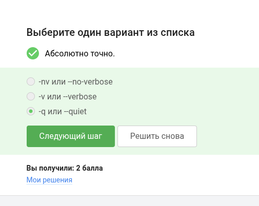
 
Выбрана -q или --quiet (quiet mode), которая отключает все сообщения. -v (verbose) — наоборот, увеличивает подробность.
 
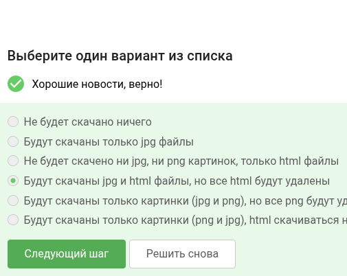
 
Ответ «Не будет скачано ничего», так как комбинация опций (-A jpg,png -R png) сначала разрешает jpg и png, затем запрещает png, и в итоге не остаётся разрешённых типов (jpg отфильтрован по одному из правил, png запрещён явно).
 
8. Работа с архивами
 
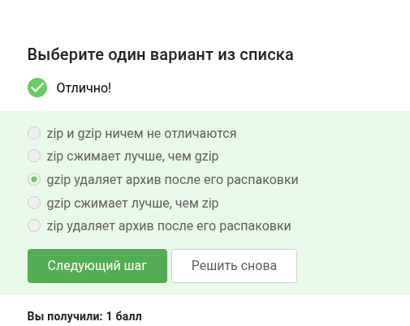
 
Правильное утверждение — «gzip удаляет архив после его распаковки». zip оставляет архив, а gzip удаляет исходный сжатый файл при распаковке.
 
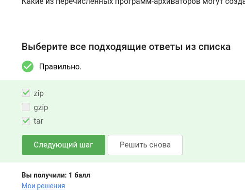
 
Правильные ответы — zip и tar. gzip сжимает только один файл и не умеет создавать многокомпонентные архивы без использования tar.
 
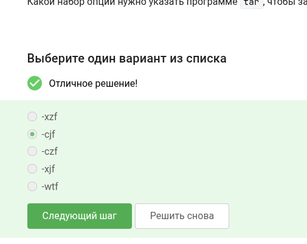
 
Выбраны -xzf (eXtract, через gZip, File). Другие комбинации (-cjf для bzip2, -xjf для .tar.xz) не подходят для gzip-сжатого архива.
 
9. Поиск файлов и слов в файлах
 
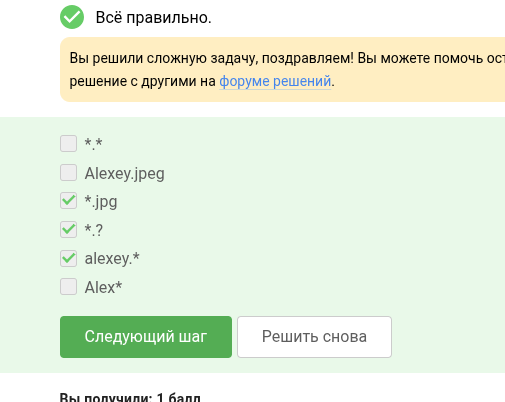
 
Отмечены все подходящие шаблоны: *.jpg, alexey.*, Alex*. Шаблон Alexey.jpeg не подходит из-за указания конкретного расширения, а не шаблона.
 
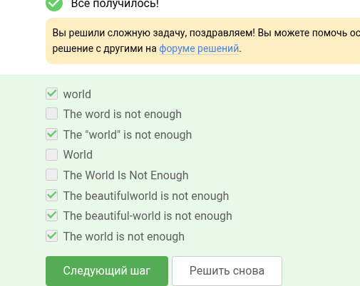
 
Правильные варианты учитывают пробелы, кавычки и дефисы: world, The "world" is not enough, The beautiful world is not enough, The beautiful-world is not enough, The world is not enough.
 
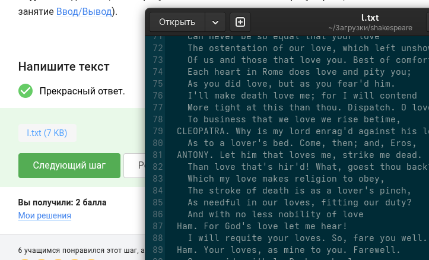
 
Требовалось указать имя файла (l.txt) и его размер (7 KB).
 
# Выводы
 
Я изучила первый модуль курса введение в линукс.
 
# Список литературы
